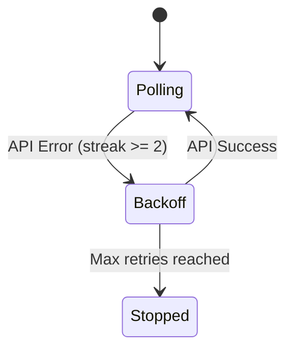
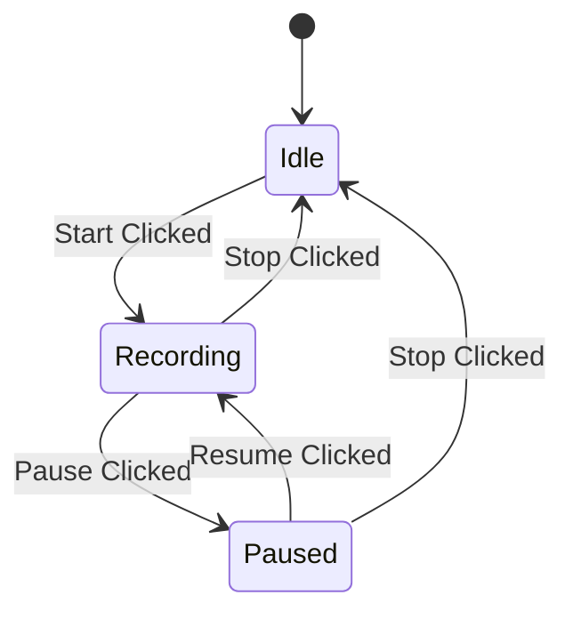

# Dashboard UI State Machine

The WineBot Dashboard (`api/ui/index.html`) operates as a polling-based state machine that synchronizes with the backend API.

## Core Loop
The dashboard runs a `runPoll()` loop typically every 5 seconds (configurable via backoff).

### Polling Cycle
1.  **Fetch Data:** Parallel requests to:
    *   `/health` (Overall system health)
    *   `/health/x11` (Display status)
    *   `/health/windows` (Window manager status)
    *   `/health/recording` (Recorder state)
    *   `/health/storage` (Disk space)
    *   `/lifecycle/status` (Process existence)
    *   `/lifecycle/events` (Recent logs)
    *   `/input/trace/client/status` (Input tracing)
    *   `/sessions/{id}/control` (Interactive policy state)

2.  **Update State:**
    *   **Badges:** Updates visual indicators (OK/Warn/Error) based on API responses.
    *   **Controls:** Enables/Disables buttons based on feature flags (e.g., hiding Recording controls if disabled).
    *   **Logs:** Appends new lifecycle events to the activity log.
    *   **Artifacts:** Fetches artifact list if session ID changes.

3.  **Handle Errors:**
    *   If API is unreachable (`pollFailureStreak >= 2`), enters **Backoff Mode**.
    *   Shows "Disconnected" overlay.
    *   Retries with exponential backoff (up to 3 minutes).

## Feature Gating

The Dashboard dynamically adapts to the backend configuration.

### Recording
*   **Source:** `/health/recording` -> `enabled` (boolean).
*   **Behavior:**
    *   If `enabled=true`: Shows "Recording" panel. Buttons (`Start`, `Stop`, `Pause`) reflect `state` (`idle`, `recording`, `paused`).
    *   If `enabled=false`: Hides "Recording" panel entirely.

### Interactive Control
*   **Source:** `/sessions/{id}/control` -> `control_mode`.
*   **Behavior:**
    *   If `control_mode=AGENT`: Shows "Agent Crosshair" overlay on VNC.
    *   If `control_mode=USER`: Hides crosshair.

### VNC / Trace
*   **Source:** `/health/x11` and `/input/trace/client/status`.
*   **Behavior:**
    *   Updates "Trace Input" toggle based on backend state.
    *   VNC canvas handles input events only if `vncTraceEnabled` is true.

## State Transitions

### Connection States

### Recording States

*Note: Transitions are validated by the backend. The UI optimistically assumes success but reverts if the next poll shows unchanged state.*
