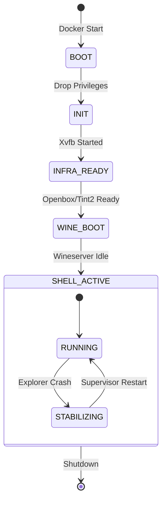

# WineBot Session Lifecycle & State Machine

This document describes the architectural state machine of a WineBot session. It defines how the system boots, maintains stability, and shuts down, including the directed dependencies between the Linux/X11 infrastructure and the Windows/Wine environment.

## 1. The Core "Layer Cake" Model

WineBot is not a flat state machine; it is a hierarchy of dependencies. Lower layers must be healthy for upper layers to function.

| Layer | Components | Responsibility | Criticality |
| :--- | :--- | :--- | :--- |
| **L0: Root** | `entrypoint.sh` (Root) | Permissions, Hardware Detection | **Fatal** (Container Exit) |
| **L1: User** | `entrypoint.sh` (User) | Session Dir, Locks, Config | **Fatal** (Container Exit) |
| **L2: Infra** | `Xvfb`, `x11vnc` | Display, Remote Access | **Fatal** (No Display = No App) |
| **L3: WM** | `openbox`, `tint2` | Window Management, Taskbar | **High** (Input/Focus fails without it) |
| **L4: Wine** | `wineserver` | Windows Kernel Emulation | **Critical** (Apps freeze/crash) |
| **L5: Shell** | `explorer.exe` | Desktop/Taskbar UI | **Medium** (Auto-restarts via Supervisor) |
| **L6: App** | `app.exe`, `recorder` | The Automation Workload | **User** (Managed by Agent) |

---

## 2. Startup Sequence (State Transitions)

The system moves through these distinct phases during boot.



### Phase 1: BOOT (Root Context)
- **Action:** Docker executes `entrypoint.sh` as root.
- **Tasks:**
  - Fix ownership of `/wineprefix` and `/artifacts` to match host UID/GID.
  - Create `/tmp/.X11-unix` socket directory.
- **Transition:** Executes `gosu winebot ...` to switch to User Context.

### Phase 2: INIT (User Context)
- **Action:** Environment sanitization.
- **Tasks:**
  - Clean stale X11 locks (`/tmp/.X99-lock`).
  - Verify Session Directory (`logs/`, `user/`).
  - Generate `session.json` manifest.
- **Transition:** Launches Xvfb.

### Phase 3: INFRA_READY (Display Layer)
- **Condition:** `xdpyinfo -display :99` returns success.
- **Tasks:**
  - **Window Manager:** `openbox --replace` (Force takeover).
  - **System Tray:** `tint2` (Provides reliable taskbar).
  - **VNC Stack:** `x11vnc` (Server) + `websockify` (Web) + `vnc_input_proxy` (Trace).
- **Correctness:** If Xvfb fails, the script exits immediately (Fast Fail).

### Phase 4: WINE_BOOT (Prefix Layer)
- **Action:** Initialize Wine environment.
- **Tasks:**
  - Start persistent `wineserver -p`.
  - Apply **WineBot Theme** (`scripts/install-theme.sh`): Blue background, Fonts, Registry.
  - Run `wineboot -u` if prefix is fresh.
- **Transition:** Waits for `wineserver` to settle.

### Phase 5: SHELL_ACTIVE (Operational)
- **Action:** The **Supervisor Loop** begins.
- **Tasks:**
  - Checks if `explorer.exe` is running.
  - **Self-Healing:** If `explorer.exe` is missing, it launches `wine explorer.exe` (Windowed Mode).
  - Starts **API Server** (`uvicorn`).
  - Starts **Recorder** (if enabled).
- **State:** The system is now ready for API/Agent commands.

---

## 3. Subcomponent Lifecycle Table

| Component | Start Command | Monitoring | Shutdown | Risk |
| :--- | :--- | :--- | :--- | :--- |
| **Xvfb** | `Xvfb :99 ... &` | PID Check | `kill <PID>` | Container Death |
| **Openbox** | `openbox --replace` | Fire-and-forget | Implicit | Input focus loss |
| **Tint2** | `tint2` | Fire-and-forget | Implicit | No System Tray |
| **Wineserver** | `wineserver -p` | **Supervisor Watchdog** | `wineserver -k` | Zombie Processes |
| **Explorer** | `wine explorer.exe` | **Supervisor Loop** | `pkill -f explorer` | Shell restart (flicker) |
| **Recorder** | `python -m ... start` | PID File | API Stop | **Data Loss (Subtitles)** |

---

## 4. Known "Hidden" States & Gaps

These are edge cases where the system state might diverge from user expectation.

### A. The "Ghost" Desktop
- **Symptom:** API says "Healthy", but screen is just Blue (X11 Root).
- **Cause:** `explorer.exe` process exists but the window is unmapped, minimized, or stuck.
- **Detection:** `scripts/diagnose-master.sh` uses `xwininfo -root -tree` to verify window mapping.
- **Fix:** `POST /lifecycle/reset_workspace` forces geometry recalculation.

### B. The "Zombie" Socket
- **Symptom:** Wine apps hang indefinitely on launch.
- **Cause:** `wineserver` crashed hard, leaving a stale `/tmp/.wine-1000/server-xxxx` socket.
- **Mitigation:** `entrypoint.sh` attempts `wineserver -k` on boot. Severe cases require container recreation.

### C. Recorder Finalization Gap
- **Symptom:** `video.mkv` exists but has no subtitles/input trace.
- **Cause:** Container was killed with `SIGKILL` (`docker rm -f`) before the recorder could run its post-processing (VTT generation).
- **Prevention:** Always use `POST /lifecycle/shutdown` or `docker stop -t 30` (SIGTERM) to allow graceful teardown.

---

## 5. Control & Observability API

WineBot exposes its lifecycle state via the API.

### Logs (`GET /lifecycle/events`)
Structured JSONL stream of all major state changes:
```json
{"kind": "session_created", "message": "Session initialized", ...}
{"kind": "supervisor_restart_explorer", "message": "Restarting explorer.exe", ...}
{"kind": "recorder_stopped", "message": "Video saved to ...", ...}
```

### Controls
| Action | Endpoint | Description |
| :--- | :--- | :--- |
| **Graceful Stop** | `POST /lifecycle/shutdown` | Stops Wine, Recorder (saves data), and Container. |
| **Fix Display** | `POST /lifecycle/reset_workspace` | Resets resolution and window manager hints. |
| **Restart WM** | `POST /openbox/restart` | Reloads Openbox config/bindings. |
| **Soft Suspend** | `POST /sessions/suspend` | Stops Wine/Recorder but keeps Container running. |

---

## 6. How to Safety Shutdown

**Do NOT** force-kill the container if you care about the recording data.

### Correct Method (API)
```bash
curl -X POST http://localhost:8000/lifecycle/shutdown
```
1. Triggers `wineboot --shutdown`.
2. Stops Recorder $
ightarrow$ Generates VTT Subtitles $
ightarrow$ Muxes MKV.
3. Exits Container.

### Correct Method (Docker)
```bash
docker stop -t 30 winebot
```
The `entrypoint.sh` traps `SIGTERM` and executes the exact same cleanup logic as the API shutdown. Ensure the timeout (`-t`) is long enough for video processing.
